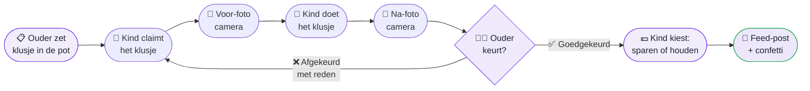
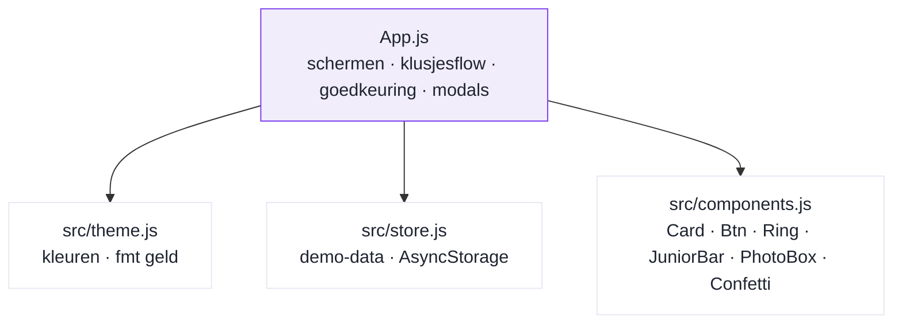

<div align="center">

# 🧹✨ Heitje voor een Karweitje

### _Klusjes doen wordt iets waar kinderen zin in krijgen._

**Een gezins-app voor huishoudelijke klusjes en zakgeld.**
Kinderen pakken een klusje uit de pot, maken een voor- en na-foto als bewijs,
en verdienen echt zakgeld zodra een ouder het goedkeurt.

<br>


<br>

`Open klusjespot` · `Foto-bewijs` · `Ouder keurt goed` · `Echt zakgeld` · `Spaardoel` · `Privé gezinsfeed`

</div>

---

## 📖 Inhoud

- [Wat is dit?](#-wat-is-dit)
- [Hoe het werkt](#-hoe-het-werkt)
- [Functies](#-functies)
- [Zo ziet het eruit](#-zo-ziet-het-eruit)
- [Kleuren](#-kleuren)
- [Aan de slag](#-aan-de-slag)
- [Onder de motorkap](#-onder-de-motorkap)
- [De demo-familie](#-de-demo-familie)
- [Regels van het product](#-regels-van-het-product)
- [Routekaart](#-routekaart)
- [Privacy vooraan](#-privacy-vooraan)
- [Licentie](#-licentie)

---

## 🎯 Wat is dit?

**Heitje voor een karweitje** is een Nederlandse uitdrukking. Het betekent: _een kleine
beloning voor een klein klusje_. Deze app maakt daar een moderne gezins-app van.

Het idee is simpel:

> Ouders zetten klusjes met een bedrag in een open pot.
> Kinderen kiezen zelf een klusje, maken het af en bewijzen het met foto's.
> Na goedkeuring van een ouder verdienen ze echt zakgeld — vrij te besteden of te sparen voor een doel.

Een privé gezinsfeed met reacties maakt meehelpen leuk, zoals de social apps die kinderen
al kennen — maar **zonder algoritme en zonder vreemden**.

> [!NOTE]
> **Status: MVP-testbuild.** Alle gegevens staan **lokaal op het toestel** (AsyncStorage).
> Synchroniseren tussen meerdere apparaten via een EU-backend is de volgende mijlpaal — zie de [Routekaart](#-routekaart).

---

## 🔄 Hoe het werkt

De hele reis van een klusje, van pot tot zakgeld:



**In woorden:**

1. 📋 Een ouder plaatst een klusje met een bedrag.
2. 🙋 Een kind pakt het klusje. Wie eerst is, mag het doen.
3. 📸 Kind maakt een **voor-foto** (alleen camera, geen fotogalerij).
4. 🧹 Kind doet het klusje.
5. 📸 Kind maakt een **na-foto**.
6. 👩‍👧 Een ouder keurt goed — of af, altijd **met reden**.
7. 💶 Bij goedkeuring kiest het kind: **sparen** voor een doel of **houden** als vrij saldo.
8. 🎉 Het klusje verschijnt in de gezinsfeed, met confetti.

---

## ✨ Functies

| | Functie | Wat het doet |
|:-:|---|---|
| 🗂️ | **Open klusjespot** | Ouders zetten klusjes met een bedrag klaar. Kinderen claimen ze, wie eerst komt. |
| 📸 | **Foto-bewijs** | Echte voor- en na-foto's met de camera. Ouder keurt goed of af (met reden). |
| 💶 | **Echt geld, geen echte betaling** | Saldo in de gezinsvaluta (€/£/$). Ouder betaalt fysiek uit en boekt het in de app. |
| 🐷 | **Digitale spaarpot** | Spaardoel met foto en streefbedrag. Per klusje kiest het kind: sparen of houden. |
| 🧒 | **Leeftijd-slimme app** | Junioren (<12) krijgen grote knoppen, meer emoji en een motivatiebalk. Tieners (12–18) een voortgangsring met percentages. Iedereen ziet echt geld. |
| 📱 | **Privé gezinsfeed** | Goedgekeurde klusjes worden posts met foto's en emoji-reacties. Alleen chronologisch, alleen familie. |
| 👨‍👩‍👧 | **Ouders zijn gelijk** | Elke ouder kan goedkeuren, beheren en uitbetalingen boeken. |
| 🚦 | **Gratis-limieten ingebouwd** | Max 5 actieve klusjes en 1 spaardoel per kind (de premium-opstapjes). |
| 🌙 | **Automatische donkere modus** | Volgt de systeeminstelling van de telefoon. |

---

## 📱 Zo ziet het eruit

> Er zijn nog geen echte screenshots. Hieronder een schets van de belangrijkste schermen.
> Zet later echte afbeeldingen in de map `assets/` en vervang deze schetsen.

<table>
<tr>
<td width="33%" valign="top">

**Klusjespot**
```
┌─────────────────┐
│  Klusjes 🧹     │
├─────────────────┤
│ 🍽️ Vaatwasser   │
│    Keuken €1,50 │
│    [ Pak dit ]  │
├─────────────────┤
│ 🛁 Badkamer     │
│    €4,00        │
│    [ Pak dit ]  │
├─────────────────┤
│ 🧹 Stofzuigen   │
│    €2,50        │
└─────────────────┘
```

</td>
<td width="33%" valign="top">

**Junior-doel**
```
┌─────────────────┐
│ 🧱 LEGO kraan   │
│                 │
│  Lekker bezig!  │
│  ▓▓▓▓░░░░░░     │
│                 │
│  €12,50 / €49,99│
└─────────────────┘
```

</td>
<td width="33%" valign="top">

**Tiener-doel**
```
┌─────────────────┐
│ 🎮 Nintendo     │
│                 │
│      ╭───╮      │
│      │38%│      │
│      ╰───╯      │
│  €22,80 / €59,99│
└─────────────────┘
```

</td>
</tr>
</table>

De junior-balk vult met woorden, nooit percentages:
`Net begonnen` → `Lekker bezig!` → `Over de helft!` → `Bijna!` → `GEHAALD! 🎉`

---

## 🎨 Kleuren

Wit en premium, met **één** accentkleur: violet. Ruime witruimte, ronde hoeken (16–24),
systeemletters. Het bedrag is altijd het grootste op zijn kaart.

**Lichte modus**


**Donkere modus**


---

## 🚀 Aan de slag

**Nodig vooraf:** [Node.js](https://nodejs.org/) 18+ en de gratis [Expo Go](https://expo.dev/go)-app op je telefoon.

```bash
npm install
npx expo install --fix   # zet de native versies gelijk aan je Expo SDK
npx expo start
```

Scan de QR-code met **Expo Go** (Android) of de **Camera-app** (iOS).
Kies een gezinslid en begin met testen. De demo-familie pas je aan in `src/store.js`.

---

## 🧩 Onder de motorkap



| Bestand | Verantwoordelijk voor |
|---|---|
| `App.js` | Alle schermen, de klusjesflow, goedkeuring, toewijzing en modals |
| `src/theme.js` | Ontwerp-tokens (wit/premium, violet accent) en geldopmaak via `fmt()` |
| `src/store.js` | Startgegevens (demo-familie) + opslag op het toestel (AsyncStorage) |
| `src/components.js` | Card, Btn, Ring, JuniorBar, PhotoBox, Confetti |
| `app.json` | Expo-configuratie incl. camera-toestemmingen |

**Techniek:** Expo SDK 54 · React Native 0.81 · AsyncStorage · expo-image-picker · react-native-svg

---

## 👨‍👩‍👧‍👦 De demo-familie

De app start met een voorbeeldgezin, zodat je meteen kunt testen:

| Wie | | Leeftijd | Rol | Modus |
|---|:-:|:-:|---|---|
| Emma | 🦊 | 10 | kind | junior (motivatiebalk) |
| Daan | 🚀 | 14 | kind | tiener (voortgangsring) |
| Papa | 😎 | 42 | ouder | beheer + goedkeuren |
| Mama | 🌷 | 41 | ouder | beheer + goedkeuren |

**Voorbeeld-spaardoelen:** Emma spaart voor een LEGO Technic kraan 🧱 (€49,99, goedgekeurd),
Daan voor een Nintendo-game 🎮 (€59,99, nog niet goedgekeurd).

---

## 📏 Regels van het product

Deze regels zijn de kern. Ze mogen niet breken:

1. 💶 **Geld** staat opgeslagen in **centen** (hele getallen). De app verwerkt **nooit** echte betalingen — saldo is alleen boekhouding.
2. 🔒 **Privacy**: geen e-mailaccounts voor kinderen, geen tracking, geen advertenties in kind-schermen, foto's blijven in het gezin.
3. 🧒 **Leeftijd-slim**: onder 12 = junior (grote knoppen, motivatiebalk met woorden). 12–18 = tiener (ring met percentages).
4. 🐷 **Spaardoel**: winkellinks werken pas nadat een ouder het doel heeft goedgekeurd. Dat is de ouderlijke poort.
5. 📱 **Feed** is alleen chronologisch — nooit aanbevelingslogica.
6. 👨‍👩‍👧 **Ouders zijn gelijk**: elke ouder kan goedkeuren, beheren en uitbetalen.

---

## 🗺️ Routekaart

| | Stap | Wat |
|:-:|---|---|
| ⬜ | **1. EU-backend** | Supabase (Frankfurt) met beveiliging per gezin: echte sync, gezins-uitnodigingscodes, foto-opslag |
| ⬜ | **2. Meldingen** | Per gebruiker instelbaar (nieuw klusje, goedkeuring, reactie, dagelijkse herinnering) |
| ⬜ | **3. Huiswerkplanner** | Weekagenda met huiswerk en klusjes samen |
| ⬜ | **4. Verdienmodel** | Gratis met advertenties (alleen ouder-schermen) · Premium €0,99/mnd of €9,99 eenmalig |
| ⬜ | **5. Meer** | Maaltijdplanning, boodschappenlijsten, terugkerende schema's, gezinsstatistieken |

---

## 🛡️ Privacy vooraan

Geen accounts of e-mailadressen voor kinderen. Geen tracking. Geen advertenties in
kind-schermen. Foto's verlaten nooit het gezin. Winkellinks zitten achter ouderlijke
goedkeuring. De app verwerkt nooit echt geld.

---

## 📄 Licentie

MIT — zie [LICENSE](LICENSE).

<div align="center">
<br>
gemaakt met hulp van Fox 🦊
</div>
